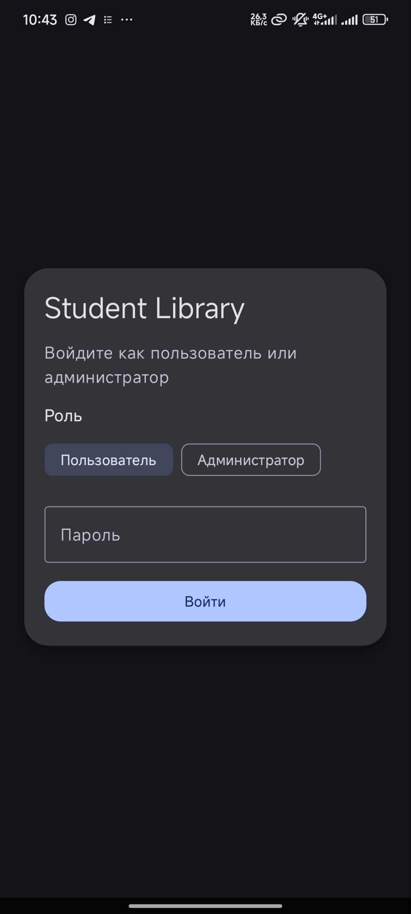
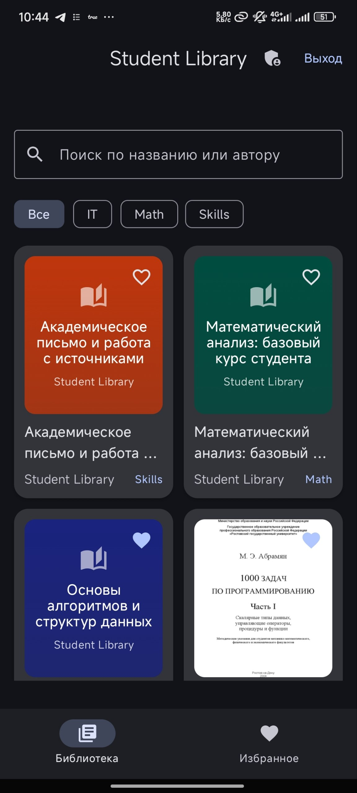
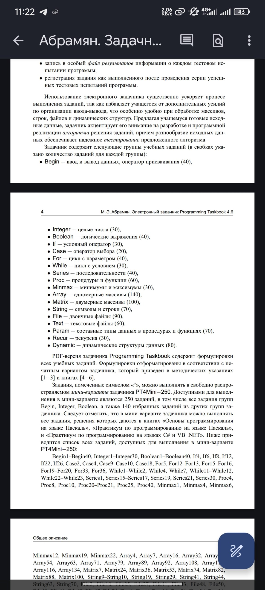
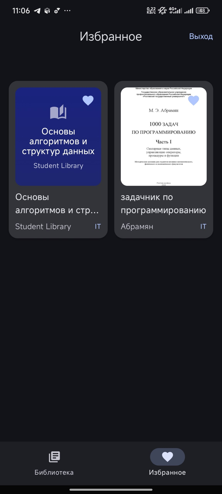
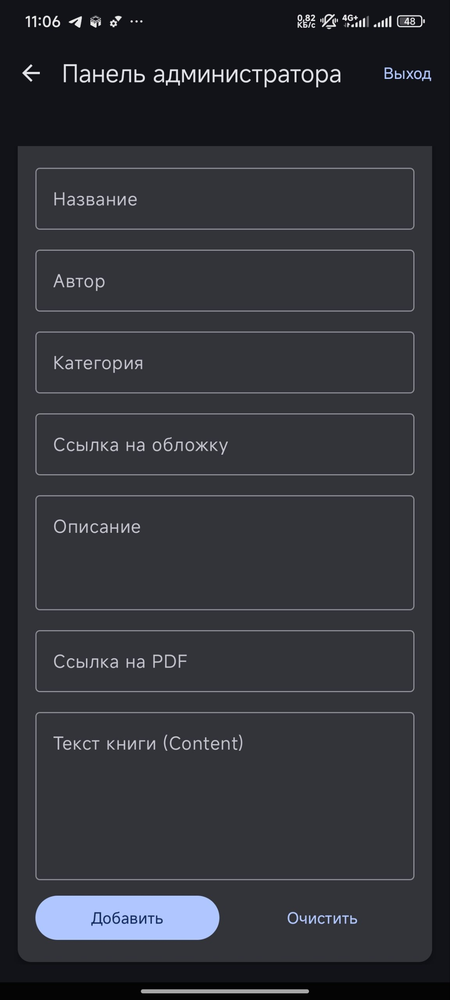

# Student Library (Android)

**Student Library** — это полнофункциональное Android-приложение, предназначенное для автоматизации работы учебной библиотеки. Проект сочетает в себе современные технологии мобильной разработки и облачные решения для обеспечения бесперебойного доступа к знаниям.

---

## ---

## 📸 Скриншоты (Screenshots)

| Экран входа | Библиотека | Детали книги |
| :---: | :---: | :---: |
|  |  |  |

| Ридер (Чтение) | Избранное | Админ-панель |
| :---: | :---: | :---: |
|  |  |  |

---

---

## 🌟 Возможности и функционал

### 📖 Функционал Студента
- **Умный поиск**: Мгновенная фильтрация книг по названию, автору или категории.
- **Интерактивный ридер**: Чтение текстового контента прямо в приложении с плавной прокруткой.
- **Персонализация**: Добавление книг в список "Избранное" (хранится локально в базе данных Room).
- **Визуализация**: Отображение обложек книг через URL-ссылки с кэшированием (Coil).

### 🔐 Функционал Администратора
- **Управление каталогом**: Полноценный CRUD (создание, чтение, обновление, удаление) книг.
- **Интеграция с Google Drive**: Инструмент для трансформации ссылок Google Drive в прямые ссылки для скачивания/отображения.
- **Облачная синхронизация**: Все изменения в админ-панели мгновенно отображаются у всех пользователей благодаря Firebase Firestore.

---

## 🛠 Технологический стек

### Core
- **Kotlin & Coroutines**: Основа приложения, обеспечивающая реактивность и асинхронность.
- **Jetpack Compose**: Современный декларативный UI с использованием Material Design 3.
- **Hilt (Dagger)**: Статическая генерация кода для внедрения зависимостей, обеспечивающая легкое тестирование.

### Data & Persistence
- **Room SQLite**: Локальное хранилище для работы в офлайн-режиме и хранения пользовательских предпочтений (избранное).
- **Firebase Firestore**: Документоориентированная NoSQL база данных для хранения общего каталога книг.
- **Repository Pattern**: Абстракция источников данных, позволяющая прозрачно переключаться между сетью и локальным кэшем.

---

## 🏗 Архитектура

Приложение следует принципам **Clean Architecture** и паттерну **MVVM**:

1.  **UI Layer (Compose)**: Отвечает за отрисовку состояния и обработку действий пользователя.
2.  **ViewModel Layer**: Управляет состоянием UI и взаимодействует с репозиторием, используя `StateFlow`.
3.  **Data Layer**:
    *   `LibraryRepository`: Единая точка доступа к данным.
    *   `LibraryDao`: Интерфейс для локальной БД.
    *   `FirestoreSeeder`: Скрипты для начального наполнения базы данных.

---

## 🚀 Настройка и развертывание

### Предварительные требования
- Android Studio Ladybug (или новее)
- Java 17
- Аккаунт Firebase

### Шаги запуска
1.  **Синхронизация Gradle**: Дождитесь завершения индексации проекта.
2.  **Firebase**:
    - Создайте проект в консоли Firebase.
    - Добавьте Android-приложение с ID `com.student.library`.
    - Скачайте `google-services.json` и поместите его в `app/`.
    - Включите **Firestore Database** в тестовом режиме.
3.  **Запуск**: Нажмите `Shift + F10` для запуска на эмуляторе.

## 🔑 Учетные данные (Demo)

Для тестирования функционала используйте предустановленные роли в объекте `DemoCredentials`:
- **Пользователь (User)**: `student123`
- **Администратор (Admin)**: `admin123`

---

## 📜 Лицензия
*Разработано в рамках образовательного проекта.*
